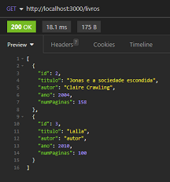
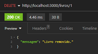
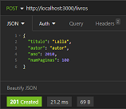
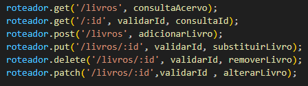

## 📚 Livraria
Liste e consulte seus livros enviando requisições em JSON :D.

### Instalando:
```
npm init
```
```
npm install express
```

Opcional para reiniciar o servidor automaticamente:

```
npm install -D nodemon
```

### Rotas:
- GET:
  -  /livros - listar todos os livros.
    
  - /:id - buscar livro por id.
- DELETE:
  - /livros/:id

    
- POST:
  - /livros *- adicionar livro, corpo em JSON*
  
- PATCH:
  - /livros/:id *- substituir campos, corpo em JSON*
- PUT:
  - /livros/:id *- substituir livro, corpo em JSON*

```
{
"titulo": "Jonas e a pedra sentimental",
"autor": "Clarice Crawling",
"ano": 2015,
"numPaginas": 184
}
```


